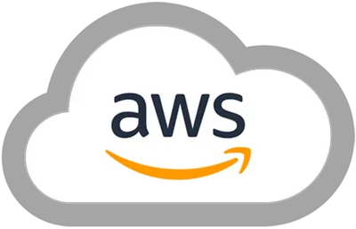
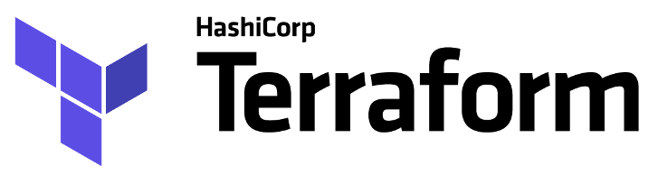

<!-- PROJECT LOGO -->
 

  

  <h3 align="center">DevOPS Assignment #2</h3>

  

    The objective of my second DevOPS assignment is to demonstrate the deployment and automated management of a load-balanced auto-scaling web application in an AWS Academy account.
      
    <a href="https://github.com/ki321g/DevOPS-Assignment-2">View Demo</a>
    ·
    <a href="https://github.com/ki321g/DevOPS-Assignment-2/issues">Report Bug</a>
    ·
    <a href="https://github.com/ki321g/DevOPS-Assignment-2/issues">Request Feature</a>
  

<!-- ABOUT THE PROJECT -->
## About The Project

The diagram below illustrates the infrastructure and services created for this assignment. The system comprises a Virtual Private Cloud (VPC) spanning three availability zones, each with private and public subnets.

Within the private subnets, application instance scaling is managed by an auto-scaling group. These application instances are registered with a load balancer’s target group and made publicly accessible via the load balancer.

Throughout this report, we will provide detailed descriptions of all infrastructure and services used.
[![Product Name Screen Shot][product-screenshot]](https://example.com)

(<a href="#readme-top">back to top</a>)

### Built With Terraform

 

Terraform is an open-source Infrastructure as Code (IaC) software tool created by HashiCorp. It allows developers to define and provision data center infrastructure using a declarative configuration language. This means you describe your desired state of infrastructure, and Terraform will figure out how to achieve that state.

With Terraform, you can manage a wide variety of service providers as well as custom in-house solutions. It has a pluggable architecture with providers to support a large number of infrastructure services such as AWS, Google Cloud, Azure, and many others.

Terraform keeps track of the current state of your infrastructure and applies incremental changes, making it efficient for versioning and collaboration. It also supports modules for creating reusable components, improving the maintainability and testability of your infrastructure code.

Terraform is widely used in DevOps practices for automating infrastructure setup and consistently replicating environments, making it a key tool in the realm of cloud automation and orchestration.

(<a href="#readme-top">back to top</a>)

<!-- USAGE EXAMPLES -->
## Usage

Use this space to show useful examples of how a project can be used. Additional screenshots, code examples and demos work well in this space. You may also link to more resources.

_For more examples, please refer to the [Documentation](https://example.com)_

(<a href="#readme-top">back to top</a>)

<!-- LICENSE -->
## License

Distributed under the MIT License. See `LICENSE.txt` for more information.

(<a href="#readme-top">back to top</a>)

<!-- CONTACT -->
## Contact

Kieron Garvey

Project Link: [https://github.com/ki321g/DevOPS-Assignment-2](https://github.com/ki321g/DevOPS-Assignment-2)

(<a href="#readme-top">back to top</a>)

<!-- ACKNOWLEDGMENTS -->
## Acknowledgments

Use this space to list resources you find helpful and would like to give credit to. I've included a few of my favorites to kick things off!

* [Terraform Modules](https://registry.terraform.io/search/modules?namespace=terraform-aws-modules)
search)

(<a href="#readme-top">back to top</a>)

